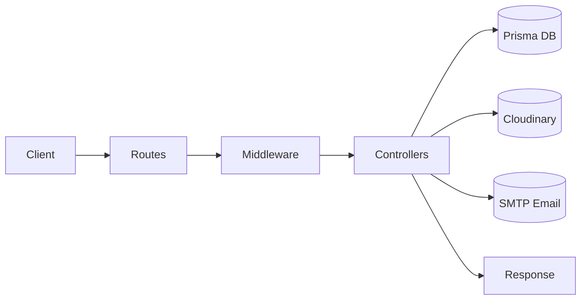

# Controllers Guide

This guide explains the controllers used in the server project, what each one does, how the logic flows, and how they connect to routes, middleware, Prisma, Cloudinary, and email delivery.

## High-Level Architecture

The server is organized around four controller areas:

1. Authentication and account management
2. File storage, download, and deletion
3. Search and relevance ranking
4. File sharing and public share access

The main request flow is:

## Shared Building Blocks

Before looking at each controller, these dependencies appear throughout the project:

- Prisma handles database reads and writes.
- bcrypt hashes and verifies passwords.
- jsonwebtoken creates JWT access tokens.
- crypto generates secure random share/reset tokens.
- Cloudinary stores uploaded files and serves download URLs.
- Nodemailer sends password-reset and share emails.
- Auth middleware protects private endpoints by validating the JWT.

## Authentication Controller

File: [server/src/controllers/auth.controller.js](../src/controllers/auth.controller.js)

This controller manages registration, login, password updates, and password recovery.

### 1. `register`

Route: `POST /api/auth/register`

Purpose:

- Creates a new user account.
- Validates required fields.
- Confirms password and confirmation match.
- Enforces password policy.
- Prevents duplicate emails.
- Stores the password as a bcrypt hash.
- Returns a JWT token and a safe user object.

Logic flow:

1. Read `firstName`, `lastName`, `email`, `password`, `confirmPassword`, and `dateOfBirth` from the request body.
2. Reject the request if any field is missing.
3. Reject the request if the passwords do not match.
4. Validate password strength with `validatePassword`.
5. Check whether the email already exists in Prisma.
6. Hash the password using bcrypt.
7. Insert the new user into the database.
8. Generate a JWT with the user id and email.
9. Return the token and user profile fields.

Why it matters:

- This is the first entry point for onboarding users.
- Password hashing keeps the database safe even if it is exposed.

### 2. `login`

Route: `POST /api/auth/login`

Purpose:

- Authenticates a user.
- Gives clearer error messages than a single generic failure.
- Returns a JWT token on success.

Logic flow:

1. Read `email` and `password` from the request body.
2. Normalize the email by trimming and lowercasing it.
3. Reject empty email or password with a specific message.
4. Look up the user by email.
5. If the user does not exist, return a message saying no account was found.
6. Compare the supplied password with the stored bcrypt hash.
7. If the password does not match, return a password-specific message.
8. Generate a JWT and return it along with the user profile.

Why it matters:

- The frontend surfaces these messages directly, so users now know whether the problem is a missing email, unknown account, or wrong password.

### 3. `changePassword`

Route: `POST /api/auth/change-password`

Auth: required

Purpose:

- Lets a signed-in user update their password from inside the app.

Logic flow:

1. Read the authenticated user id from `req.user.id`.
2. Read `oldPassword`, `newPassword`, and `confirmPassword`.
3. Reject if any field is missing.
4. Reject if the new password and confirmation do not match.
5. Validate password strength.
6. Load the user from Prisma.
7. Compare the old password with the stored hash.
8. Hash the new password.
9. Update the password in the database.

Why it matters:

- This supports in-session password changes without using email recovery.

### 4. `forgotPassword`

Route: `POST /api/auth/forgot-password`

Purpose:

- Starts password recovery by generating a reset token and emailing a reset link.

Logic flow:

1. Read `email` from the request body.
2. Reject missing email.
3. Search for the user.
4. If the user does not exist, return a neutral success message so the endpoint does not reveal whether the email is registered.
5. Generate a 32-byte random token.
6. Set an expiration time one hour in the future.
7. Save the token and expiration on the user record.
8. Build a frontend reset URL using `CLIENT_URL` or `http://localhost:5173`.
9. Send the reset email.
10. If email delivery fails, return `502` and do not pretend the process succeeded.

Why it matters:

- This is the start of the email-based reset flow.
- The link points to the frontend page that actually submits the password reset.

### 5. `resetPassword`

Route: `POST /api/auth/reset-password`

Purpose:

- Finalizes the password reset using the token that was sent by email.

Logic flow:

1. Read `token`, `newPassword`, and `confirmPassword`.
2. Reject missing values.
3. Reject mismatched passwords.
4. Validate password strength.
5. Find the user by `passwordResetToken`.
6. Reject if the token is missing or invalid.
7. Reject if the token is expired.
8. Hash the new password.
9. Update the password and clear the reset token fields.
10. Return a success message.

Why it matters:

- This is the secure completion step of password recovery.

## File Controller

File: [server/src/controllers/file.controller.js](../src/controllers/file.controller.js)

This controller handles file uploads, listing, downloads, and deletion.

### 1. `uploadFiles`

Route: `POST /api/files/upload`

Auth: required

Purpose:

- Accepts uploaded files from the client.
- Enforces file-count and file-size limits.
- Pushes the file data into Cloudinary.
- Stores metadata in the database.

Important note:

- The route currently expects files under the form field name `files`.

Logic flow:

1. Check `req.files`.
2. Reject the request if no files were uploaded.
3. Sum the user’s existing file storage usage from Prisma.
4. Add the size of the incoming files.
5. Reject the upload if the total exceeds the 1 GB limit.
6. For each uploaded file:
   - Send the buffer to Cloudinary.
   - Save a file record with the original name, Cloudinary public id, resource type, URL, size, and mime type.
7. Return the created file metadata.

Why it matters:

- This is the persistence layer for uploaded documents and media.
- The saved metadata is what later powers file listing, sharing, and downloads.

### 2. `listFiles`

Route: `GET /api/files`

Auth: required

Purpose:

- Returns the signed-in user’s files with pagination and optional search.

Logic flow:

1. Read page, limit, and search query values.
2. Build a Prisma filter for the current user.
3. Optionally filter by filename using case-insensitive matching.
4. Query the matching rows and total count.
5. Convert `BigInt` file sizes to normal numbers for JSON.
6. Return the list plus paging metadata.

Why it matters:

- This powers the file manager screen and dashboard counters.

### 3. `downloadFile`

Route: `GET /api/files/:id/download`

Auth: required

Purpose:

- Streams a file back to the owner.

Logic flow:

1. Read the file id from the route params.
2. Load the file record from Prisma.
3. Reject if the file is missing.
4. Reject if the authenticated user is not the owner.
5. Build a Cloudinary private download URL.
6. Fetch the file bytes.
7. Stream the remote response back to the client.
8. Set `Content-Type` and `Content-Disposition` so the browser downloads the file with the original name.

Why it matters:

- This is the owner-only secure download path.

### 4. `deleteFile`

Route: `DELETE /api/files/:id`

Auth: required

Purpose:

- Removes a file from Cloudinary and deletes its database record.

Logic flow:

1. Load the file by id.
2. Reject if it does not exist.
3. Reject if the current user is not the owner.
4. Attempt to delete the Cloudinary asset.
5. Log Cloudinary cleanup failures but do not block database deletion.
6. Delete the Prisma record.
7. Return success.

Why it matters:

- This keeps the file list and storage backend in sync as much as possible.

## Search Controller

File: [server/src/controllers/search.controller.js](../src/controllers/search.controller.js)

This controller powers the user search experience. It combines filename matching, extracted content search, semantic ranking, and structured filters.

### Shared helpers used by search

The controller uses a few internal helpers to keep the search logic predictable:

- `normalizeSearchTerm` trims input and turns empty values into an empty string.
- `tokenizeSearchTerm` splits the query into useful keywords and removes stop words.
- `buildKeywordWhere` builds the Prisma `where` clause for filename, extracted content, file type, and date filters.
- `getKeywordMatches` extracts matches from filenames, file content, semantic captions, and labels.
- `getSemanticMatch` compares query embeddings with stored file embeddings and assigns a semantic score when the result is strong enough.
- `buildFileSearchPayload` combines keyword and semantic matches into the final search result object.
- `getSearchResults` is the shared internal search pipeline used by both normal search and advanced search.

Search depends on the extracted content and vector data generated by the upload flow, so the best results appear after files have been indexed.

### 1. `searchFiles`

Route: `GET /api/search?q=...&page=...&limit=...`

Auth: required

Purpose:

- Runs the standard authenticated search endpoint.
- Returns paginated results for the signed-in user.

Logic flow:

1. Read `q`, `page`, and `limit` from the query string.
2. Normalize the query and reject empty input.
3. Tokenize the query into keywords.
4. Try to generate a semantic embedding for the query.
5. Build the Prisma keyword filter for the current user.
6. Load matching files along with their extracted content and semantic embedding data.
7. If no keyword matches are found, retry with a broader base filter so the user still gets relevant indexed files.
8. Score results using filename matches, content matches, captions, labels, and semantic similarity.
9. Sort by relevance, then by match count, then by newest file.
10. Return the paginated payload with total counts and match metadata.

Why it matters:

- This is the main user-facing search route.
- The search result objects include match context so the UI can show why a file matched.

### 2. `searchFileContent`

Route: `GET /api/files/:fileId/search?q=...`

Auth: required

Purpose:

- Searches inside one file instead of across the whole workspace.
- Returns match snippets and relevance metadata for a single file.

Logic flow:

1. Read `fileId` from the route params and `q` from the query string.
2. Reject missing search text.
3. Load the file with its extracted content and semantic embedding.
4. Reject missing files.
5. Reject requests for files that do not belong to the authenticated user.
6. Try to embed the query for semantic scoring.
7. Build the file search payload with a higher preview match limit.
8. Return file metadata plus match details, match count, semantic score, and relevance score.

Why it matters:

- This supports the in-file search experience and makes the content extraction work visible to the user.

### 3. `advancedSearch`

Route: `POST /api/search/advanced`

Auth: required

Purpose:

- Runs a richer search request with explicit filters.
- Accepts file type and date range filters in the request body.

Logic flow:

1. Read `query` and `filters` from the request body.
2. Normalize the query.
3. Pass the filters into the shared search pipeline.
4. Use the maximum page size so the controller can score the full result set.
5. Return the search results plus the applied filters.

Why it matters:

- This is the structured search path when the frontend needs more control than a simple query string.

Search behavior notes:

- Keyword search checks original filename, extracted content, semantic captions, and labels.
- Semantic search uses `embedSearchQuery` and compares against stored vectors with cosine similarity.
- The controller prefers exact keyword matches, but still returns semantic matches when the similarity threshold is strong enough.
- Filters can narrow results by MIME type and creation date range.
- Search results include `matchedBy`, `matchCount`, `matches`, `semanticScore`, and `relevanceScore`.

## Share Controller

File: [server/src/controllers/share.controller.js](../src/controllers/share.controller.js)

This controller creates share links and serves share metadata.

### 1. `createShare`

Route: `POST /api/shares`

Auth: required

Purpose:

- Creates one share record per recipient.
- Sends a unique share link to each recipient.
- Supports `recipientEmail`, `recipientEmails`, or `recipients` as input.

Logic flow:

1. Read `fileId`, recipient input, `expirationHours`, and `message`.
2. Normalize recipients so the request can accept:
   - a single string email,
   - a comma-separated string,
   - or an array of emails.
3. Remove blanks and duplicates.
4. Reject the request if there is no file id, no recipients, or no expiration value.
5. Load the file from Prisma.
6. Reject if the file is missing.
7. Reject if the file does not belong to the authenticated user.
8. Compute the expiration timestamp.
9. Create one `FileShare` row per recipient.
10. Generate a unique share token and URL for each recipient.
11. Send the email to every recipient in parallel.
12. If every send fails, delete all created share rows and return `502`.
13. If some sends fail, return `207` with the failed recipients.
14. If all sends succeed, return `201` with all share URLs.

Why it matters:

- This is the main collaboration flow in the app.
- Each recipient gets a unique public share URL, which matches the project requirement.

### 2. `listShares`

Route: `GET /api/shares`

Auth: required

Purpose:

- Lists all shares created by the current user.

Logic flow:

1. Query all share records where `ownerId` matches the authenticated user.
2. Sort newest first.
3. Return the list.

Why it matters:

- This supports share history and management screens.

Returned fields:

- `fileName`
- `recipientEmail`
- `createdAt`
- `expiresAt`
- `openedAt`
- `status` as `opened` or `pending`
- `token`

### 3. `publicShare`

Route: `GET /public/share/:token`

Auth: not required

Purpose:

- Serves public metadata for a share token.
- Lets the client show file details before download.

Logic flow:

1. Read the token from the route.
2. Find the matching share record.
3. Reject invalid or expired tokens.
4. Load the related file.
5. Mark the share as opened the first time it is accessed.
6. Return file metadata and share metadata.

Why it matters:

- This is the public entry point for someone who receives a share link.

## Public Download Route

File: [server/src/routes/public.routes.js](../src/routes/public.routes.js)

Even though this file is a route module, it contains the same file-download logic for public shares.

Route: `GET /public/share/:token/download`

Purpose:

- Allows a recipient to download the shared file without logging in.

Logic flow:

1. Validate the share token.
2. Reject expired or missing shares.
3. Load the file attached to that share.
4. Mark the share as opened.
5. Build a Cloudinary private download URL.
6. Stream the file to the client.

Why it matters:

- This is the actual download endpoint for public sharing.

## Email Utility Used By Controllers

File: [server/src/utils/email.js](../src/utils/email.js)

This is not a controller, but it is essential to the controller logic.

It provides:

- `sendResetEmail(to, resetUrl)` for password recovery
- `sendShareEmail(to, shareUrl, message)` for file sharing

The share email now sends both plain text and HTML content so the link is easy to click in email clients.

## Important Response Patterns

- `400` means the request is missing data or contains invalid values.
- `401` means the user is not authenticated.
- `403` means the authenticated user is not allowed to access the resource.
- `404` means the target file, share, or user record does not exist.
- `410` means a share link expired.
- `502` is used when an email action fails after the database step succeeded or when the email must be treated as mandatory.
- `500` means an unexpected server-side error.

## What To Remember When Extending The Controllers

1. Keep business rules in the controller, not in the route file.
2. Keep password validation consistent by reusing `validatePassword`.
3. Keep ownership checks before any destructive or private action.
4. Keep email delivery and database state aligned so the API does not claim success when the mail never left.
5. Keep file download paths separate for authenticated owner downloads and public share downloads.

## Controller Summary

- `auth.controller.js`: registration, login, password updates, and recovery.
- `file.controller.js`: upload, list, download, and delete.
- `search.controller.js`: workspace search, single-file search, semantic ranking, and advanced filters.
- `share.controller.js`: create shares, list shares, and serve public share metadata.

If you want, I can also turn this into a diagram-heavy version or add the controller guide for the Task 2 backend project as a separate document.
